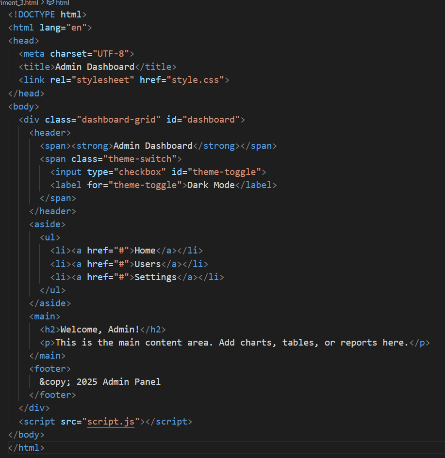
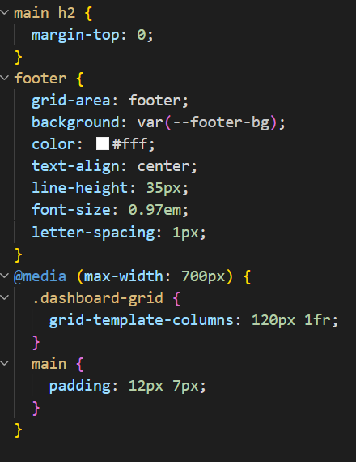

# 🎯 Aim

To design and build a **professional, responsive admin dashboard** using **HTML**, **CSS Grid**, and **JavaScript**. The dashboard will include a dynamic **theme switcher** (light/dark modes), focusing on responsive layouts and adaptable UI design.

---

# 🛠️ Task Description

Create a **web-based admin dashboard interface** with the following components:

- **Header**: Displays the dashboard title and includes a theme switch (light/dark mode).
- **Sidebar**: Contains navigation links such as **Home**, **Users**, and **Settings**.
- **Main Content Area**: Acts as a placeholder for **data visualization**, reports, or welcome messages.
- **Footer**: Displays copyright.

The page must:

- Use **CSS Grid** for a clean, structured layout.
- Be fully **responsive** for desktop and mobile views.
- Implement a **theme switching** feature that dynamically updates UI colors and styles without reloading the page.

---

## Screenshots
### Code-HTML5

### Code-CSS

### Result

# 📘 Learning Outcomes

By completing this task, you will be able to:
- Apply **CSS Grid** to design responsive web layouts.
- Structure HTML semantically for better readability and accessibility.
- Use **JavaScript** to manipulate DOM elements and implement real-time UI changes.
- Develop a **light/dark theme toggle** that updates global styles dynamically.
- Improve skills in **design adaptability**, **user experience (UX)**, and **front-end best practices**.
