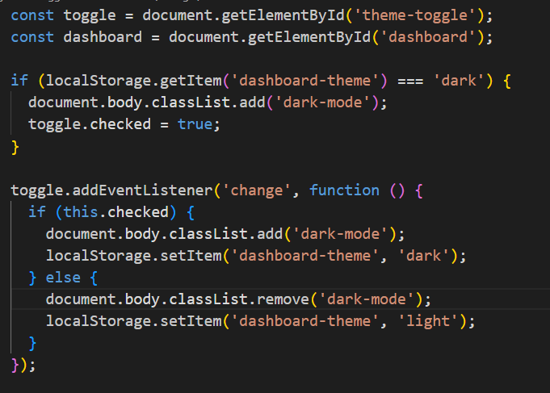

# 🧑‍💻 Responsive Admin Dashboard with Theme Switching

## 🎯 AIM
Design and build a **professional, responsive admin dashboard** interface using **HTML, CSS Grid layout**, and a **theme switching** feature (light and dark modes). This task will enhance your layout structuring skills and your ability to create adaptable and user-friendly interfaces.

---

## 📋 Task Description

### 📦 Dashboard Sections to Include

- **Header**
  - Displays the dashboard title.
  - Includes a button to toggle between light and dark themes.

- **Sidebar**
  - Contains navigation links such as **Home**, **Users**, and **Settings**.

- **Main Content Area**
  - Placeholder area for **data visualization**, reports, or welcome messages.

- **Footer**
  - Displays footer text or © copyright.

---

### 🎨 UI & Functionality Requirements

- **CSS Grid Layout**
  - Use CSS Grid to arrange and align sections into a clean layout.

- **Responsive Design**
  - Dashboard must work well on:
    - ✅ Desktop  
    - ✅ Tablet  
    - ✅ Mobile  

- **Theme Switching (Light/Dark)**
  - A toggle button that:
    - Updates background and text colors.
    - Affects the entire dashboard.
    - Works without reloading the page (using JavaScript).

---

## 📸 Screenshots
### Code – HTML5  

### Code – CSS  
  

### Code – JavaScript  

### Output – Light Theme  

### Output – Dark Theme  

---

## 🎯 Learning Outcome

- Learn how to build **grid-based responsive layouts** using CSS.
- Gain practical experience in building a **realistic admin interface**.
- Understand how to implement **dynamic theme switching** with JavaScript.
- Strengthen skills in **UI/UX design**, **styling consistency**, and **cross-device compatibility**.
